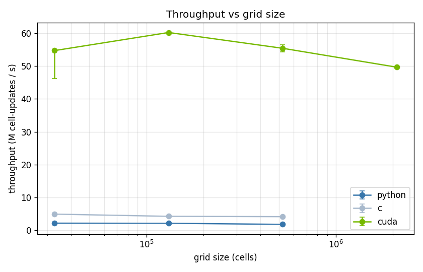
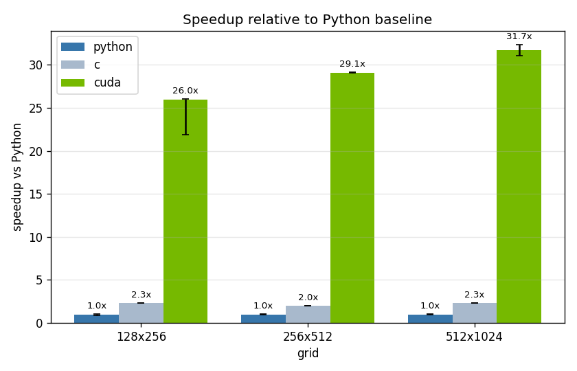

# Benchmarks

Performance comparison of the three implementations (Python, C, CUDA) on the
same problem at increasing grid resolution.

## Methodology

- Each runner is invoked with `--no-output` (pure compute, no frame I/O), a
  fixed step count, and the `rk2` scheme.
- `--warmup-steps 20` runs are executed untimed before the timer starts, to
  exclude cold-cache and one-off allocation costs.
- The timed section is repeated (`--repeats`) and the **median** wall time is
  reported; the median is robust to occasional OS scheduling spikes.
- The headline metric is **throughput**:

  $$\text{cell-updates/s} = \frac{N_x \cdot N_y \cdot \text{steps}}{\text{wall time}}$$

  It is normalized per cell per step, so it does not depend on the step count
  and is directly comparable across grids and implementations.

- All runs use `--scheme rk2` and `--seed 42`. The scheme must match across
  runs (rk2 does roughly twice the flux work of euler); the seed only sets the
  initial perturbation field and does not affect compute cost.

Sweep parameters: `--steps 1000`, `--warmup-steps 20`, `--scheme rk2`,
`--seed 42`. Local CPU runs used `--repeats 3`; the CUDA run used `--repeats 5`.

## Hardware

The CPU and GPU runs were measured on **different machines**, so the comparison
is "throughput achievable per platform", not a controlled same-box head-to-head.

| Role            | Spec                                                            |
| --------------- | --------------------------------------------------------------- |
| CPU (Python, C) | Intel Core i7-10750H, 6 cores / 12 threads, 12 MB L3, 16 GB RAM |
| GPU (CUDA)      | NVIDIA Tesla T4 15 GB (Kaggle; one GPU used)                    |
| C compiler      | gcc 14.2.0, `-O3 -std=c11`                                      |
| CUDA compiler   | nvcc 12.8, `-O3 -std=c++14`                                     |
| Python          | CPython 3.13.5, numpy 2.4.4                                     |

The Python and C runners are single-threaded scalar code; numpy provides
vectorized inner kernels for the Python runner.

## Results

Throughput in millions of cell-updates per second; speedup is relative to the
Python runner at the same grid. Memory is peak host RSS for Python/C and peak
device memory for CUDA.

<div align="center">

| Grid      | Impl   | Wall (s) | Throughput (M/s) | Speedup |     Memory |
| --------- | ------ | -------: | ---------------: | ------: | ---------: |
| 128x256   | Python |    15.54 |             2.11 |    1.0x |  53 MB RSS |
| 128x256   | C      |     6.73 |             4.87 |    2.3x |  14 MB RSS |
| 128x256   | CUDA   |     0.60 |            54.75 |   26.0x |  14 MB GPU |
| 256x512   | Python |    63.31 |             2.07 |    1.0x |  94 MB RSS |
| 256x512   | C      |    31.24 |             4.20 |    2.0x |  53 MB RSS |
| 256x512   | CUDA   |     2.17 |            60.27 |   29.1x |  52 MB GPU |
| 512x1024  | Python |   300.04 |             1.75 |    1.0x | 263 MB RSS |
| 512x1024  | C      |   128.13 |             4.09 |    2.3x | 206 MB RSS |
| 512x1024  | CUDA   |     9.45 |            55.45 |   31.7x | 206 MB GPU |
| 1024x2048 | CUDA   |    42.21 |            49.69 |       - | 818 MB GPU |




</div>

## Discussion

**CUDA throughput stays roughly flat (~50-60 M cell-updates/s) across all
grids.** The GPU is not cache-bound the way a CPU is; small grids (128x256)
actually underperform slightly because there is too little work to saturate the
streaming multiprocessors, and the largest grid (1024x2048) dips mildly as it
becomes memory-bandwidth bound at an 818 MB working set.

**The CPU runners lose throughput as the grid grows.** At 128x256 the working
set fits in the 12 MB L3 cache; by 256x512 it spills to main memory and the
runners become bandwidth bound. C degrades sooner in relative terms than Python
because it computes each cell faster, so it hits the memory wall first.

**The C port is a steady ~2-2.3x over Python.** numpy already dispatches vectorized SIMD kernels for the array
operations, so the gap is the cost of Python-level loop overhead and temporaries,
not interpreted arithmetic.

**CUDA gives ~26-32x over Python and ~13-14x over C at the larger grids**, and
the speedup grows with grid size as the GPU has more work to hide latency
behind. The 1024x2048 case has no CPU row because a single run would take far
too long on the CPU runners.

## Reproducing

```bash
# CPU sweep (Python + C)
make -C src/c
python scripts/bench.py --impls python,c \
    --grids 128x256,256x512,512x1024 \
    --output results/bench_local.csv

# GPU sweep (CUDA), e.g. on a CUDA-capable host
make -C src/cuda
python scripts/bench.py --impls cuda \
    --grids 128x256,256x512,512x1024,1024x2048 \
    --repeats 5 --output results/bench_cuda.csv

# plots
python scripts/plot_bench.py --csv results/bench_local.csv results/bench_cuda.csv
```
