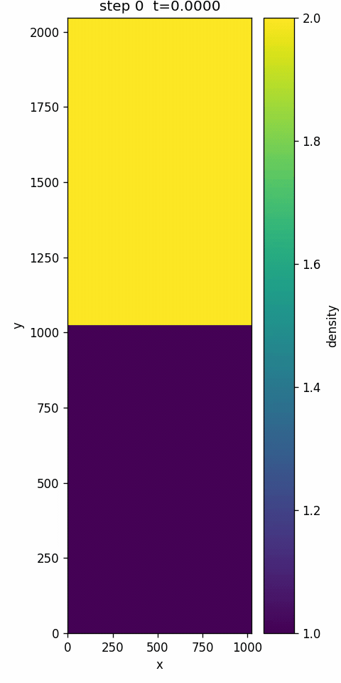

# Rayleigh-Taylor Instability Simulation

A 2D compressible-Euler simulation of the Rayleigh-Taylor instability, implemented three ways, Python, C, and CUDA, for comparison.

<div align="center">
  
  <p><em>Density field evolution on a 1024×2048 grid, the characteristic mushroom structures of the Rayleigh-Taylor instability.</em></p>
</div>

## What this is

The three runners solve the same equations (2D compressible Euler with artificial diffusion) on the same uniform grid, with periodic boundaries in $x$ and rigid walls in $y$.

> **Note:** Each implementation has its own copy of the CLI and frame writer, kept in sync with the reference spec at `src/common/cli_spec.py` and `src/common/frame_io.py`.

See [`docs/math.md`](docs/math.md) for the governing equations, time integration, and CFL condition.

## Quick start

### Dependencies

- Python: `numpy`, `matplotlib`
- System: `ffmpeg` (required by animation script), `gcc` and `make` (for the C runner), `nvcc`, `make`, and a CUDA-capable GPU (for the CUDA runner)

Set up a virtual env for the Python runner and the analysis scripts:

```bash
python3 -m venv .venv
source .venv/bin/activate
pip install numpy matplotlib
```

### Python

```bash
python src/python/run.py \
    --Nx 256 --Ny 512 --t-end 2.0 \
    --save-interval 400 \
    --output-dir results/py_256x512_t2
```

### C

Requires `gcc` and `make`.

```bash
make -C src/c
./src/c/run --Nx 256 --Ny 512 --t-end 2.0 \
    --save-interval 400 \
    --output-dir results/c_256x512_t2
```

### CUDA

Requires `nvcc`, `make`, and a CUDA-capable GPU.

```bash
make -C src/cuda
./src/cuda/run --Nx 256 --Ny 512 --t-end 2.0 \
    --save-interval 400 \
    --output-dir results/cuda_256x512_t2
```

### Plot / animate

```bash
python scripts/plot_frame.py results/c_256x512_t2/frame_010000.bin
python scripts/animate.py    results/c_256x512_t2
```

All three runners accept the same flags; run `--help` for the full list.

## License

MIT - see [LICENSE](LICENSE).
